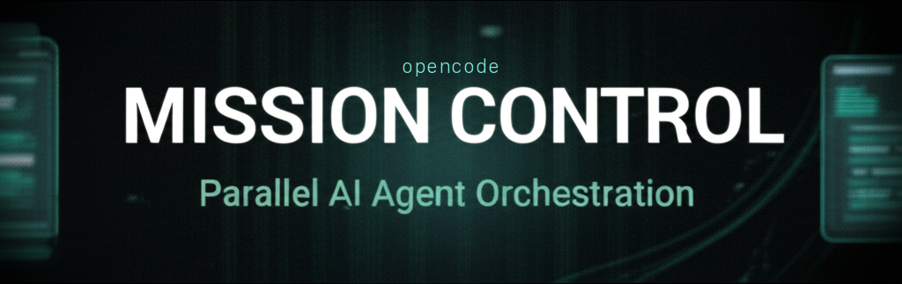

<p align="center">
  
</p>

<h1 align="center">OpenCode Mission Control</h1>

<p align="center">
  <strong>Parallelize your AI coding agents. Ship faster.</strong>
</p>

<p align="center">
  <a href="https://www.npmjs.com/package/opencode-mission-control"></a>
  <a href="https://opensource.org/licenses/MIT"></a>
  <a href="https://github.com/nigel-dev/opencode-mission-control/stargazers"></a>
  <a href="https://github.com/nigel-dev/opencode-mission-control/issues"></a>
</p>

<p align="center">
  <a href="#quick-start">Quick Start</a> &bull;
  <a href="#how-it-works">How It Works</a> &bull;
  <a href="#tools-reference">Tools Reference</a> &bull;
  <a href="#orchestrated-plans">Orchestrated Plans</a> &bull;
  <a href="#configuration">Configuration</a> &bull;
  <a href="#faq">FAQ</a>
</p>

---

## The Problem

AI coding is fast, but context switching is slow. Running multiple agents in a single directory leads to file conflicts, messy git history, and "who-changed-what" headaches. You end up waiting for one agent to finish before starting the next, wasting the most valuable resource you have: **your time**.

## The Solution

Mission Control orchestrates **isolated environments** for your AI agents. Each job gets its own git worktree and tmux session — complete filesystem isolation. You can monitor progress, capture output, or attach to any session at any time. When the work is done, sync changes back or create a PR with a single command.

For complex multi-task workflows, the **Plan System** handles dependency graphs, merge ordering, automated testing, and PR creation — all orchestrated automatically.

## How It Works

```
                          ┌─────────────────────────┐
                          │     Your Main Session    │
                          │   (Command Center)       │
                          └────────────┬────────────┘
                                       │
                          mc_launch / mc_plan
                                       │
                   ┌───────────────────┼───────────────────┐
                   │                   │                   │
            ┌──────┴──────┐     ┌──────┴──────┐     ┌──────┴──────┐
            │   Job A     │     │   Job B     │     │   Job C     │
            │  Worktree   │     │  Worktree   │     │  Worktree   │
            │  + tmux     │     │  + tmux     │     │  + tmux     │
            └──────┬──────┘     └──────┬──────┘     └──────┬──────┘
                   │                   │                   │
                   └───────────────────┼───────────────────┘
                                       │
                               mc_diff / mc_pr
                               mc_merge / mc_sync
                                       │
                                       ▼
                              ┌─────────────────┐
                              │   Main Branch   │
                              └─────────────────┘
```

1. **Launch** — `mc_launch` creates a git worktree + tmux session and starts an AI agent inside it
2. **Monitor** — The background monitor polls every 10s, tracking output, idle state, and pane death
3. **Observe** — Use `mc_status`, `mc_capture`, or `mc_attach` to check on progress
4. **Integrate** — Use `mc_diff` to review, `mc_pr` to create a PR, `mc_merge` to merge, or `mc_sync` to rebase

---

## Quick Start

### Prerequisites

| Tool | Required | Purpose |
|------|----------|---------|
| **[tmux](https://github.com/tmux/tmux)** | Yes | Session isolation and monitoring |
| **[git](https://git-scm.com/)** | Yes | Worktree management |
| **[gh](https://cli.github.com/)** | For `mc_pr` | GitHub PR creation |

### Installation

```bash
npm install opencode-mission-control
```

Add to your `opencode.json`:

```json
{
  "plugins": [
    "opencode-mission-control"
  ]
}
```

### Your First Job

```
You: "Fix the login bug and add the pricing table — do both at once."

AI: Launching two parallel jobs now.
    → mc_launch(name: "fix-login", prompt: "Fix the authentication bug in...")
    → mc_launch(name: "add-pricing", prompt: "Create a pricing table component...")

You: "How's the login fix going?"

AI: → mc_capture(name: "fix-login")
    Still running. Here's the latest output from that session...

You: "Login fix looks good. Create a PR."

AI: → mc_pr(name: "fix-login", title: "Fix: auth token validation")
    PR created: https://github.com/you/repo/pull/42
```

---

## Tools Reference

### Job Lifecycle

#### `mc_launch`

Launch a new parallel AI coding session in an isolated worktree.

| Parameter | Type | Required | Default | Description |
|-----------|------|----------|---------|-------------|
| `name` | `string` | Yes | — | Job name (used for branch name and tmux target) |
| `prompt` | `string` | Yes | — | Task prompt for the spawned AI agent |
| `branch` | `string` | No | `mc/{name}` | Git branch name |
| `placement` | `"session"` \| `"window"` | No | Config default | `session` creates a new tmux session; `window` adds a window to the current session |
| `mode` | `"vanilla"` \| `"plan"` \| `"ralph"` \| `"ulw"` | No | Config default | Execution mode (see [OMO Integration](#omo-integration)) |
| `planFile` | `string` | No | — | Plan file path (for `plan` mode) |
| `copyFiles` | `string[]` | No | — | Files to copy from main worktree (e.g. `[".env", ".env.local"]`) |
| `symlinkDirs` | `string[]` | No | — | Directories to symlink (e.g. `["node_modules"]`). `.opencode` is always included. |
| `commands` | `string[]` | No | — | Shell commands to run after worktree creation (e.g. `["bun install"]`) |

**What happens on launch:**
1. Creates a new git worktree on a dedicated branch
2. Runs post-create hooks (copy files, create symlinks, run commands)
3. Spins up a tmux session or window
4. Starts `opencode --prompt '...'` inside the tmux pane
5. Sets up pane-died hook for completion detection
6. Registers the job for background monitoring

#### `mc_jobs`

List all jobs with their current status.

| Parameter | Type | Required | Default | Description |
|-----------|------|----------|---------|-------------|
| `status` | `"all"` \| `"running"` \| `"completed"` \| `"failed"` | No | `"all"` | Filter by status |

#### `mc_status`

Get detailed status of a specific job including branch, worktree path, tmux target, duration, and mode.

| Parameter | Type | Required | Description |
|-----------|------|----------|-------------|
| `name` | `string` | Yes | Job name |

#### `mc_capture`

Capture the last N lines of terminal output from a job's tmux pane.

| Parameter | Type | Required | Default | Description |
|-----------|------|----------|---------|-------------|
| `name` | `string` | Yes | — | Job name |
| `lines` | `number` | No | `100` | Number of lines to capture |

#### `mc_attach`

Get the tmux command to attach to a job's terminal session.

| Parameter | Type | Required | Description |
|-----------|------|----------|-------------|
| `name` | `string` | Yes | Job name |

#### `mc_kill`

Stop a running job by terminating its tmux session/window.

| Parameter | Type | Required | Default | Description |
|-----------|------|----------|---------|-------------|
| `name` | `string` | Yes | — | Job name |
| `force` | `boolean` | No | `false` | Force kill |

#### `mc_cleanup`

Remove finished job worktrees and metadata.

| Parameter | Type | Required | Default | Description |
|-----------|------|----------|---------|-------------|
| `name` | `string` | No | — | Specific job to clean up |
| `all` | `boolean` | No | `false` | Clean up all non-running jobs |
| `deleteBranch` | `boolean` | No | `false` | Also delete the git branch |

---

### Monitoring & Reporting

#### `mc_overview`

Get a complete dashboard overview of all Mission Control activity — running jobs, recent completions, failures, active plans, alerts, and suggested next actions. This is the best starting point when checking in on your jobs.

*No parameters.*

#### `mc_report`

Report agent status back to Mission Control. Auto-detects which job is calling based on the current worktree. This tool is designed to be called by spawned agents from within their managed worktrees — it cannot be used from the main session.

| Parameter | Type | Required | Default | Description |
|-----------|------|----------|---------|-------------|
| `status` | `"working"` \| `"blocked"` \| `"needs_review"` \| `"completed"` \| `"progress"` | Yes | — | Current agent status |
| `message` | `string` | Yes | — | Human-readable status message |
| `progress` | `number` | No | — | Completion percentage (0–100) |

Reports are used by the monitoring system to:
- Trigger notifications (e.g., when an agent reports `blocked` or `needs_review`)
- Signal explicit completion (a `completed` report immediately marks the job as done)
- Provide progress visibility via `mc_status` and `mc_overview`

---

### Git Workflow

#### `mc_diff`

Compare a job's branch against the base branch.

| Parameter | Type | Required | Default | Description |
|-----------|------|----------|---------|-------------|
| `name` | `string` | Yes | — | Job name |
| `stat` | `boolean` | No | `false` | Show diffstat summary only |

#### `mc_pr`

Push the job's branch and create a GitHub Pull Request. Requires the `gh` CLI to be authenticated.

| Parameter | Type | Required | Default | Description |
|-----------|------|----------|---------|-------------|
| `name` | `string` | Yes | — | Job name |
| `title` | `string` | No | Job prompt | PR title |
| `body` | `string` | No | — | PR description |
| `draft` | `boolean` | No | `false` | Create as draft PR |

#### `mc_sync`

Pull the latest changes from the base branch into a job's worktree.

| Parameter | Type | Required | Default | Description |
|-----------|------|----------|---------|-------------|
| `name` | `string` | Yes | — | Job name |
| `strategy` | `"rebase"` \| `"merge"` | No | `"rebase"` | Sync strategy. Aborts on conflict and reports affected files. |

#### `mc_merge`

Merge a job's branch back into the main worktree.

| Parameter | Type | Required | Default | Description |
|-----------|------|----------|---------|-------------|
| `name` | `string` | Yes | — | Job name |
| `strategy` | `"squash"` \| `"ff-only"` \| `"merge"` | No | Config `mergeStrategy` (default `"squash"`) | Merge strategy. `squash` squashes all commits; `ff-only` rebases then fast-forwards; `merge` creates a merge commit (`--no-ff`). |
| `squash` | `boolean` | No | `false` | **Deprecated** — use `strategy` instead. If set and no `strategy` is provided, `squash: true` maps to `strategy: "squash"`. |
| `message` | `string` | No | Auto-generated | Merge commit message |

---

## Orchestrated Plans

For workflows with dependencies between jobs, the **Plan System** manages the full lifecycle — from parallel execution to merge ordering to PR creation.

### `mc_plan`

Create and start a multi-job orchestrated plan.

| Parameter | Type | Required | Default | Description |
|-----------|------|----------|---------|-------------|
| `name` | `string` | Yes | — | Plan name |
| `jobs` | `JobSpec[]` | Yes | — | Array of job definitions (see below) |
| `mode` | `"autopilot"` \| `"copilot"` \| `"supervisor"` | No | `"autopilot"` | Execution mode |
| `placement` | `"session"` \| `"window"` | No | Config default | tmux placement for all jobs in this plan |

**JobSpec fields:**

| Field | Type | Required | Description |
|-------|------|----------|-------------|
| `name` | `string` | Yes | Unique job name |
| `prompt` | `string` | Yes | Task prompt for the AI agent |
| `dependsOn` | `string[]` | No | Job names this job depends on (must complete and merge first) |
| `touchSet` | `string[]` | No | File globs this job expects to modify |
| `copyFiles` | `string[]` | No | Files to copy into the worktree |
| `symlinkDirs` | `string[]` | No | Directories to symlink into the worktree |
| `commands` | `string[]` | No | Post-creation shell commands |

### Plan Modes

| Mode | Behavior |
|------|----------|
| **Autopilot** | Full hands-off execution. Jobs launch, merge, and a PR is created automatically. |
| **Copilot** | Plan is created in `pending` state. You review it with `mc_plan_status`, then approve with `mc_plan_approve` to start. |
| **Supervisor** | Execution pauses at **checkpoints** (`pre_merge`, `on_error`, `pre_pr`) requiring manual `mc_plan_approve` to continue. |

### Plan Lifecycle

```
mc_plan
  │
  ├─ Validate (unique names, valid deps, no circular deps)
  ├─ Create integration branch: mc/integration/{plan-id}
  │
  ├─ [copilot] ──→ Pause (pending) ──→ mc_plan_approve ──→ Continue
  │
  ├─ Topological sort jobs by dependencies
  ├─ Launch jobs (respects maxParallel limit)
  │
  │   ┌──────── Reconciler Loop (5s) ────────┐
  │   │                                       │
  │   │  • Check dependency satisfaction      │
  │   │  • Launch ready jobs                  │
  │   │  • Process merge train                │
  │   │  • [supervisor] Pause at checkpoints  │
  │   │                                       │
  │   └───────────────────────────────────────┘
  │
  ├─ Merge Train: merge each job into integration branch
  │   ├─ Merge (--no-ff)
  │   ├─ Run test command (if configured)
  │   ├─ On failure → rollback merge, mark failed
  │   └─ On conflict → abort, mark conflict
  │
  ├─ All jobs merged → push integration branch
  └─ Create PR via gh CLI
```

### Plan Control Tools

#### `mc_plan_status`

Show the current state of the active plan — job statuses, progress, and any checkpoints.

*No parameters.*

#### `mc_plan_approve`

Approve a copilot plan to start execution, or clear a supervisor checkpoint to continue.

| Parameter | Type | Required | Description |
|-----------|------|----------|-------------|
| `checkpoint` | `"pre_merge"` \| `"on_error"` \| `"pre_pr"` | No | Specific checkpoint to clear (supervisor mode) |

#### `mc_plan_cancel`

Cancel the active plan. Stops all running jobs, deletes the integration branch, and cleans up state.

*No parameters.*

### Example: Orchestrated Plan

```
AI: I'll create a plan for the dashboard feature with proper dependencies.

→ mc_plan(
    name: "dashboard-feature",
    mode: "autopilot",
    jobs: [
      {
        name: "db-schema",
        prompt: "Add the analytics tables to the database schema"
      },
      {
        name: "api-endpoints",
        prompt: "Create REST endpoints for the analytics dashboard",
        dependsOn: ["db-schema"]
      },
      {
        name: "dashboard-ui",
        prompt: "Build the analytics dashboard React components",
        dependsOn: ["api-endpoints"]
      },
      {
        name: "docs",
        prompt: "Update API documentation for analytics endpoints",
        dependsOn: ["api-endpoints"]
      }
    ]
  )

Result:
  • db-schema launches immediately
  • api-endpoints waits for db-schema to merge
  • dashboard-ui and docs wait for api-endpoints — then run in parallel
  • Once all merge successfully, a PR is created automatically
```

### Merge Train

The Merge Train is the engine behind plan integration. Each completed job's branch is merged into a dedicated **integration branch** (`mc/integration/{plan-id}`):

1. **Merge** — `git merge --no-ff {job-branch}` into the integration worktree
2. **Test** — If a `testCommand` is configured (or detected from `package.json`), it runs after each merge
3. **Rollback** — If tests fail or time out, the merge is automatically rolled back (`git merge --abort` or `git reset --hard HEAD~1`)
4. **Conflict detection** — Merge conflicts are caught, reported with file-level detail, and the merge is aborted

Once all jobs are merged and tests pass, the integration branch is pushed and a PR is created.

---

## Slash Commands

These commands run directly in the OpenCode chat — instant execution without an AI roundtrip (except `/mc-launch`, which delegates to the AI).

| Command | Description |
|---------|-------------|
| `/mc` | Show Mission Control dashboard overview (runs `mc_overview`) |
| `/mc-jobs` | List all jobs and their status |
| `/mc-launch <prompt>` | Launch a new parallel agent (delegates to AI) |
| `/mc-status <name>` | Detailed status of a specific job |
| `/mc-attach <name>` | Get the tmux attach command |
| `/mc-cleanup [name]` | Clean up finished jobs (all if no name given) |

---

## Monitoring System

Mission Control runs an active background monitor — not a passive wrapper.

### How Monitoring Works

| Mechanism | Interval | What It Does |
|-----------|----------|--------------|
| **Polling** | Every `pollInterval` (default 10s) | Checks if each job's tmux pane is still running |
| **Pane death detection** | Immediate | tmux `pane-died` hook fires when a pane closes, capturing exit status |
| **Idle detection** | `idleThreshold` (default 5min) | Hashes terminal output; if unchanged for the threshold period and the session shows the idle prompt (`ctrl+p commands`), marks the job as completed |
| **Exit code capture** | On pane death | Exit code `0` → completed. Non-zero → failed. |
| **Session state detection** | On idle check | Distinguishes `idle` (waiting for input), `streaming` (AI is working), and `unknown` states |

### Hooks & Lifecycle

| Hook | Trigger | Behavior |
|------|---------|----------|
| `session.idle` | User's main session goes quiet | Shows toast notification with running job summary (rate-limited to once per 5 minutes) |
| `session.compacting` | OpenCode compacts context | Injects current job state into the AI's memory so it stays aware of background work |
| `pane-died` | tmux pane closes | Immediately captures exit status and updates job state |

---

## Configuration

Configuration is stored at `~/.local/share/opencode-mission-control/{project}/config.json`.

```json
{
  "defaultPlacement": "session",
  "pollInterval": 10000,
  "idleThreshold": 300000,
  "worktreeBasePath": "~/.local/share/opencode-mission-control",
  "maxParallel": 3,
  "autoCommit": true,
  "mergeStrategy": "squash",
  "testCommand": "bun test",
  "testTimeout": 600000,
  "worktreeSetup": {
    "copyFiles": [".env", ".env.local"],
    "symlinkDirs": ["node_modules"],
    "commands": ["bun install"]
  },
  "omo": {
    "enabled": true,
    "defaultMode": "vanilla"
  }
}
```

### Configuration Reference

| Field | Type | Default | Description |
|-------|------|---------|-------------|
| `defaultPlacement` | `"session"` \| `"window"` | `"session"` | Default tmux placement for new jobs |
| `pollInterval` | `number` | `10000` | Monitoring poll interval in ms (minimum 10s) |
| `idleThreshold` | `number` | `300000` | Time in ms before an idle session is marked completed (default 5min) |
| `worktreeBasePath` | `string` | `~/.local/share/opencode-mission-control` | Root directory for worktrees |
| `maxParallel` | `number` | `3` | Maximum concurrent jobs in an orchestrated plan |
| `autoCommit` | `boolean` | `true` | Whether to auto-commit changes in job worktrees before merging |
| `mergeStrategy` | `"squash"` \| `"ff-only"` \| `"merge"` | `"squash"` | Default merge strategy for `mc_merge` (can be overridden per-merge via the `strategy` param) |
| `testCommand` | `string` | — | Command to run after each merge in the merge train (e.g. `"bun test"`) |
| `testTimeout` | `number` | `600000` | Timeout for test command in ms (default 10min) |
| `worktreeSetup.copyFiles` | `string[]` | — | Files to copy into every new worktree (e.g. `.env`) |
| `worktreeSetup.symlinkDirs` | `string[]` | — | Directories to symlink into every new worktree (e.g. `node_modules`) |
| `worktreeSetup.commands` | `string[]` | — | Shell commands to run in every new worktree (e.g. `bun install`) |
| `omo.enabled` | `boolean` | `false` | Enable Oh-My-OpenCode integration |
| `omo.defaultMode` | `string` | `"vanilla"` | Default execution mode for spawned agents |

### Worktree Setup

Every job creates a fresh git worktree. The `worktreeSetup` config (and per-job `copyFiles`/`symlinkDirs`/`commands` params) lets you prepare the environment:

- **`copyFiles`** — Copies files from the main worktree (great for `.env`, config files)
- **`symlinkDirs`** — Creates symlinks to avoid re-downloading (great for `node_modules`, `.cache`)
- **`commands`** — Runs shell commands after setup (great for `bun install`, `pip install -e .`)

Per-job parameters are **merged** with the global `worktreeSetup` config.

---

## OMO Integration

If you use [Oh-My-OpenCode (OMO)](https://github.com/nicholasgriffintn/oh-my-opencode), Mission Control unlocks advanced execution modes for spawned agents. These are **optional** — everything works without OMO installed.

| Mode | What It Does |
|------|--------------|
| `vanilla` | Standard `opencode --prompt '...'` execution |
| `plan` | Loads a Sisyphus plan. Copies `.sisyphus/plans` to the worktree and runs `/start-work`. |
| `ralph` | Starts a self-correcting Ralph Loop via `/ralph-loop` |
| `ulw` | Activates high-intensity Ultrawork mode via `/ulw-loop` |

OMO detection is automatic — Mission Control checks your `opencode.json` for the `oh-my-opencode` plugin.

---

## FAQ

**Q: Where are worktrees stored?**
A: By default in `~/.local/share/opencode-mission-control/{project}/`. They are real git worktrees — fully functional working copies.

**Q: Can I use this without tmux?**
A: No. tmux is the backbone of session isolation, monitoring, idle detection, and output capture. It's a hard requirement.

**Q: Does it work with VS Code / Cursor?**
A: Yes. You can open any job's worktree directory in your editor. The AI agents run in background tmux sessions independently.

**Q: What happens if my computer restarts?**
A: Mission Control will detect dead tmux panes on the next poll and mark those jobs as failed. Use `mc_cleanup` to clean up.

**Q: How many jobs can I run at once?**
A: As many as your machine can handle. Each job is a real OS process with its own file tree. The `maxParallel` setting only applies to orchestrated plans. Individual `mc_launch` calls have no built-in limit.

**Q: What if two jobs edit the same file?**
A: Since each job has its own worktree, there are no runtime conflicts. Conflicts surface at merge time — either via `mc_merge` or the plan's merge train.

**Q: Can I attach to a job's terminal while it's running?**
A: Yes. Use `mc_attach` to get the tmux command, then run it in your terminal. You'll see the live AI session.

**Q: How does the plan merge train handle test failures?**
A: If the configured `testCommand` fails after a merge, the merge is automatically rolled back. The job is marked as failed and the plan status updates accordingly (in supervisor mode, it pauses for your review).

**Q: Is this built by the OpenCode team?**
A: No. This is an independent community plugin — not affiliated with or endorsed by the OpenCode team.

---

## Development

```bash
bun install
bun run build
bun test
```

## Contributing

Found a bug? Have an idea? Check out [CONTRIBUTING.md](CONTRIBUTING.md).

## License

MIT
